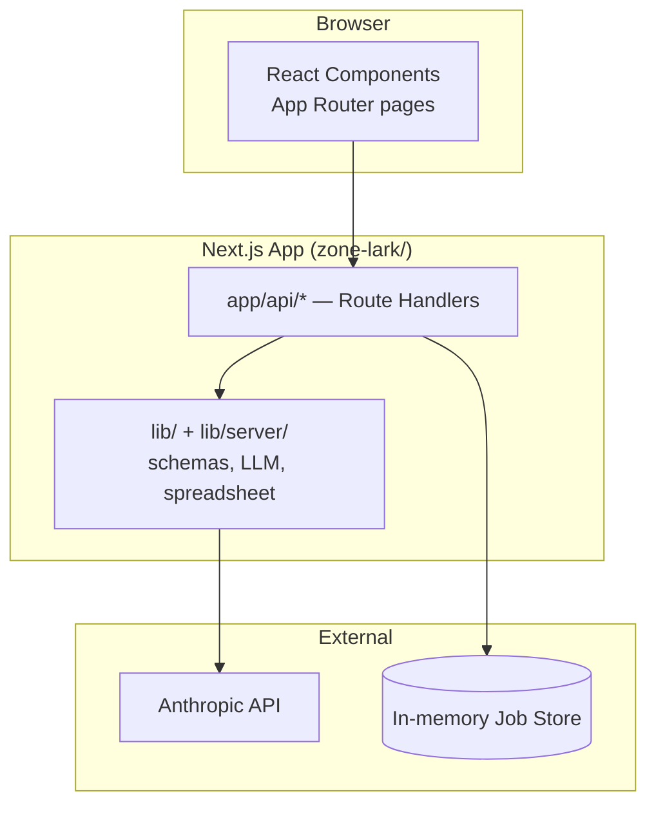
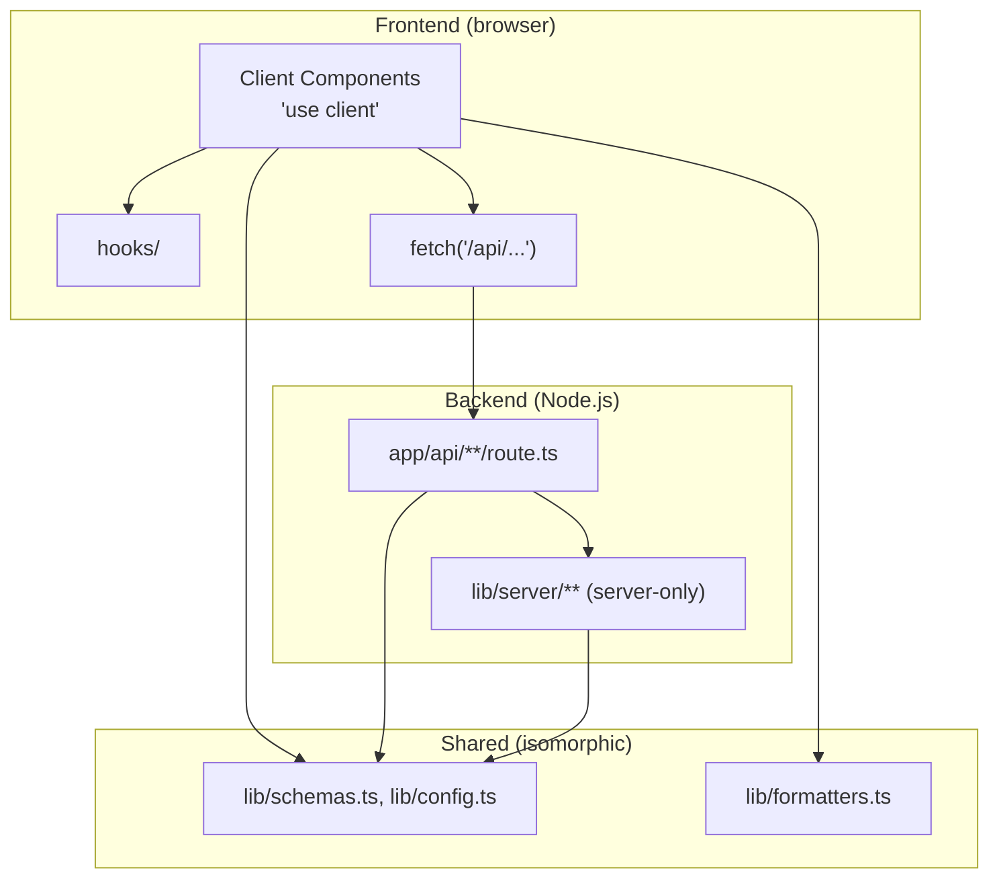
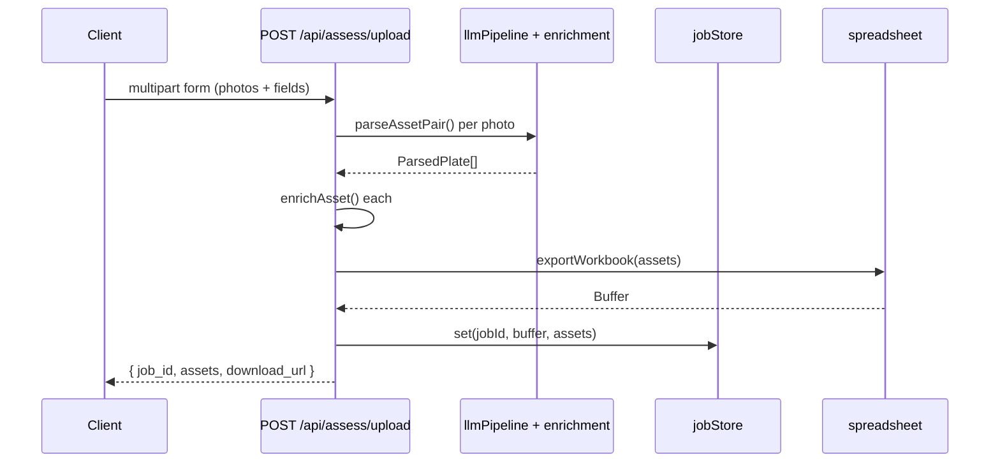
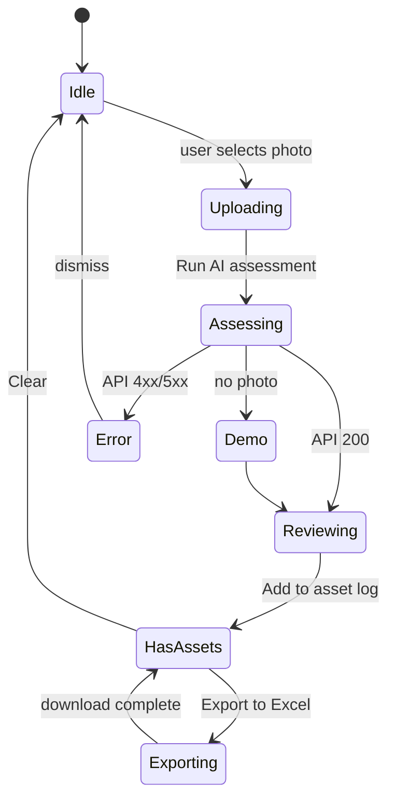

# Zonelark — App Architecture

**Zonelark** is a single **Next.js app** (`zone-lark/`) that serves both the React dashboard and the REST API. Assessors upload photos of building assets, an LLM extracts asset data, and the app exports an Excel workbook.

The app is open (no login) and self-contained — no database or external infra beyond the Anthropic API.

---

## 1. Project structure

```
TLGRepo/
├── Plan.md                   # this file
├── CLAUDE.md                 # points to zone-lark/AGENTS.md
└── zone-lark/                # the app
    ├── app/
    │   ├── layout.tsx, page.tsx, globals.css
    │   └── api/              # Route Handlers (REST API)
    ├── components/           # React dashboard UI (layout/ upload/ form/ assets/ ui/)
    ├── hooks/                # client hooks (health, session, image preprocess)
    ├── lib/
    │   ├── schemas.ts, config.ts, formatters.ts
    │   ├── sampleAssets.ts   # demo + mock sample rows (single source)
    │   ├── demoData.ts       # re-exports sampleAssets for demo mode
    │   ├── workbook.ts       # ExcelJS builder (shared with mock script)
    │   └── server/           # server-only: enrichment, llmPipeline, spreadsheet, jobStore
    ├── src/mockData.ts       # `npm run mock` → sample_outputs/
    ├── sample_outputs/Zonelark_SAMPLE.xlsx
    └── AGENTS.md             # agent + dev commands
```

### Layers

| Layer | Technology | Notes |
|-------|------------|-------|
| API | Next.js Route Handlers | `/api/health`, `/api/assess/*`, `/api/job/:id`, `/api/export/:id` |
| Business logic | `lib/` + `lib/server/` | Server modules isolated with `server-only`; Excel core in `lib/workbook.ts` |
| Frontend | React components | `Dashboard.tsx` — multi-photo upload, extracted-field review, confirm-to-log |
| Sample data | `lib/sampleAssets.ts` + `npm run mock` | Regenerates `Zonelark_SAMPLE.xlsx` |
| Dev tooling | Prettier + lefthook, webpack dev | `npm run dev` uses `--webpack` (stable); `npm run dev:turbo` optional |
| Job state | In-memory `jobStore` | Single-process only; a multi-instance deployment would need a shared store |

---

## 2. Architecture

A **single full-stack Next.js app** serves the React UI and the API. Business logic lives in `lib/` and `lib/server/`.



### Frontend / backend separation (within one app)

Next.js is a full-stack framework, so the app is one deployable unit with clear **logical** boundaries rather than separate frontend/backend repos.



| Boundary | Implementation |
|----------|----------------|
| HTTP | UI calls `/api/*` Route Handlers — same origin, no CORS |
| Server vs client | Interactive UI = `'use client'`; static shell can stay Server Components |
| Server-only code | LLM pipeline, Excel export, job store in `lib/server/` (`import 'server-only'`), only imported from Route Handlers |
| Secrets | `ANTHROPIC_API_KEY` read only server-side — never exposed to the client |

If requirements grow (long-running workers, separate API consumers), `lib/server/` modules can be extracted into a standalone service without rewriting the UI.

### Framework choices

| Decision | Choice | Rationale |
|----------|--------|-----------|
| Router | App Router (`app/`) | Current default; Route Handlers for the API |
| Language | TypeScript | — |
| Styling | Tailwind CSS v4 | Design tokens in `globals.css` via `@theme inline` |
| Icons | `@tabler/icons-react` | Tree-shakeable React icons |
| Server boundary | `lib/server/` + `server-only` | Enforces backend/frontend separation at module level |

---

## 3. API contract

| Method | Path | Request | Response |
|--------|------|---------|----------|
| `GET` | `/api/health` | — | `{ status, year, version }` |
| `POST` | `/api/assess/upload` | `multipart/form-data` | `{ job_id, assets_processed, assets?, download_url }` |
| `POST` | `/api/assess/manual` | `AssetRecord[]` JSON | `{ job_id, assets_processed, download_url }` |
| `GET` | `/api/job/:jobId` | — | `{ job_id, assets }` |
| `GET` | `/api/export/:jobId` | — | `.xlsx` binary |

### Assess flow



### Client state



Client logic lives in `hooks/useAssetSession.ts` (assets, jobId, assess/confirm/export), `hooks/useServerHealth.ts` (polls `/api/health`), and `hooks/useImagePreprocess.ts` (canvas resize/contrast). Demo mode loads from `lib/demoData.ts` when no photo is selected.

---

## 4. Risks and mitigations

| Risk | Impact | Mitigation |
|------|--------|------------|
| LLM request exceeds platform timeout | Upload fails mid-pipeline | Async job pattern / longer timeout |
| `exceljs` bundle/ESM issues | Build failure | `serverExternalPackages: ['exceljs']`; keep routes on Node runtime |
| Large photo uploads | 413 errors | Client-side preprocess + platform body-size config |
| Duplicated Uniformat/LIFE_EXP maps | Drift between table and export | Single source in `lib/config.ts` |

---

## 5. Testing checklist

| # | Test | Expected |
|---|------|----------|
| 1 | `GET /api/health` | `{ status: "ok" }` |
| 2 | Dashboard loads, server badge online | Green badge |
| 3 | Demo assess (no photo) | Extracted fields populate; confirm adds row |
| 4 | Photo upload + assess (with API key) | Real asset from Claude; multi-photo supported |
| 5 | Edit extracted fields before confirm | Overrides merge into logged asset |
| 6 | Summary bar counts | Match table data |
| 7 | Export Excel | Valid `.xlsx` downloads |
| 8 | Clear assets | Table empty state |
| 9 | Mobile viewport | Camera/gallery buttons visible |
| 10 | Dark mode | CSS variables switch via `prefers-color-scheme` |
| 11 | `npm run mock` | Regenerates `sample_outputs/Zonelark_SAMPLE.xlsx` |

---

## 6. Out of scope

- Authentication, multi-tenant facilities, database, object storage
- Replacing Anthropic with another model provider
